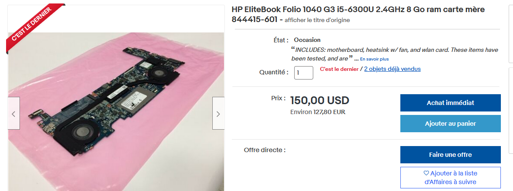
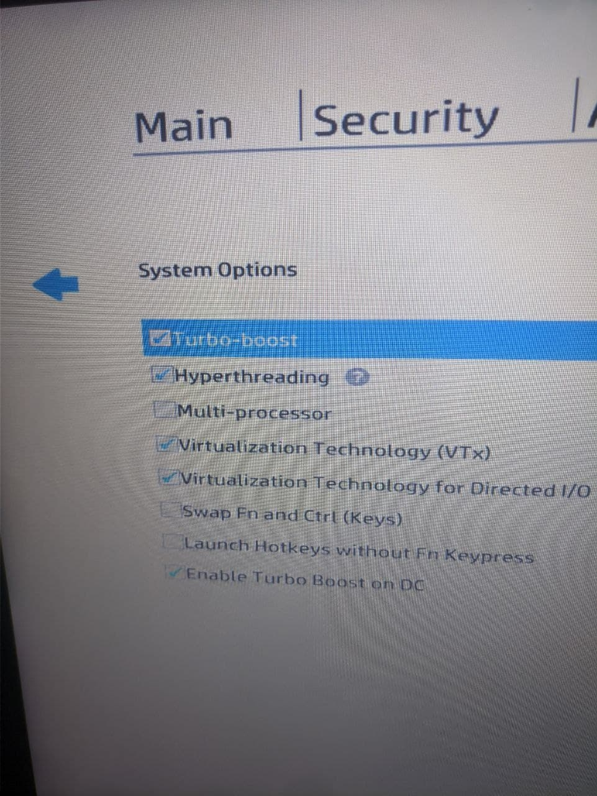


## The 1040 g3 : a great, but not very upgradeable laptop

|  | 
|:--:| 
| *The EliteBook 1040 g3* |

I got my hand on this laptop at the end of my internship at Kayentis (alongside many others laptop, they basically gave me the whole warehouse of used laptop that could not be used again). This was by far the best one of the lot, but it was given to me because it was defective, so I had to fix it if I wanted to use it. 

This Laptop is a significant upgrade over the slightly older HP EliteBook 840 G1 that I was using before (and also got for free, trough my mom's job).
It is a very modern style of enterprise Office laptop. The device is extremely thin (Apple MacBook level thin) the touchpad does not have physical clickable button (instead the whole touchpad is clickable, which is not something I particularly like), it has a very good backlit keyboard, a much more respectable battery life than any laptop I had before  (like 7 hours + depending on the usage), as well as a much better screen and the ram and CPU are soldered to the motherboard (which of course is annoying for ram upgrades). Putting aside the soldered ram and the touchpad it is essentially the type of laptop I like the most.

## The problem
The laptop would randomly crash to a blue screen under Windows, to a complete system freeze under Linux. Sometime, the device would not even boot successfully (it would crash in the middle of booting). Of course a full reinstall of Windows or Linux (Fedora 34) did not fix the problem either. The crashes were very frequent and would also happen in the middle of the multiple reinstalls I tried.

## Possible solutions
Of course a motherboard replacement would certainly fix the problem entirely, but this option is very expensive (at least 150 € if you add the shipping cost).

|  | 
|:--:| 
| *Ebay listing for a 1040 g3 motherboard* |

Another solution would be to put the motherboard in a oven, at a temperature of over 120 degree Celsius, in an attempt to resolder possibly damaged solder point. In my opinion, for this specific problem it had a very low chance of success and could actually kill the motherboard entirely. But this actually a serious type of solution that works well for some type of electronics, see the relevant [Linus tech Tips video](https://www.youtube.com/watch?v=8Xanr4jkmEc) on the subject.

The first thing to try is then to mess around with bios settings. The first thing I thought of was to disable intel turbo boost technology (which temporarily overclocks the processor to gain performance in specific tasks). Disabling this meant that the processor could not reach higher frequency that might be unstable, so it was a good thing to try. However, that did not fix the problem.

Similarly, I tried to disable intel's implementation of SMT ([Simultaneous multithreading](https://en.wikipedia.org/wiki/Simultaneous_multithreading)), hyperthreading. That did not fix the problem either.

## The actual solution 
It turns out that tinkering with the bios settings was a good idea after all. In the bios setting, under system configuration, there is a option called `Multi-processor`. Disabling this option will disable the second core (supposedly but there is no way to select which core to disable, in my case it turned out to be the correct one but I just got lucky). After that, the laptop worked perfectly. So, according to my investigation, this laptop has a defective processing core, which is kind of unique and rare problem, so it was hard to diagnose.

|  | 
|:--:| 
| *The Multi-processor option*

## Conclusion 
Now I have a fully working laptop, but the performance is degraded, as the processor normally has 2 cores, now it only has one (with hyperthreading enabled), so it's effectively a single core processor, which is a bit crazy in 2021. Even tough, it is quite usable in everyday task and hardly noticeable. The one task where the performance degradation is most noticeable is watching youtube in 1080p 60fps, which is not possible as the video hangs regularly. This is due to the fact that gpu accelerated youtube playback still doesn't work by default on Linux, so it's using the cpu instead, which is also very bad for energy efficiency. I could play youtube in that quality on my 840 g1 (which had 2 working cores) without problems, with CPU acceleration. Next I will try to enable hardware acceleration (or wait until it's enabled by default on Firefox in Linux, which should happen at some point)
