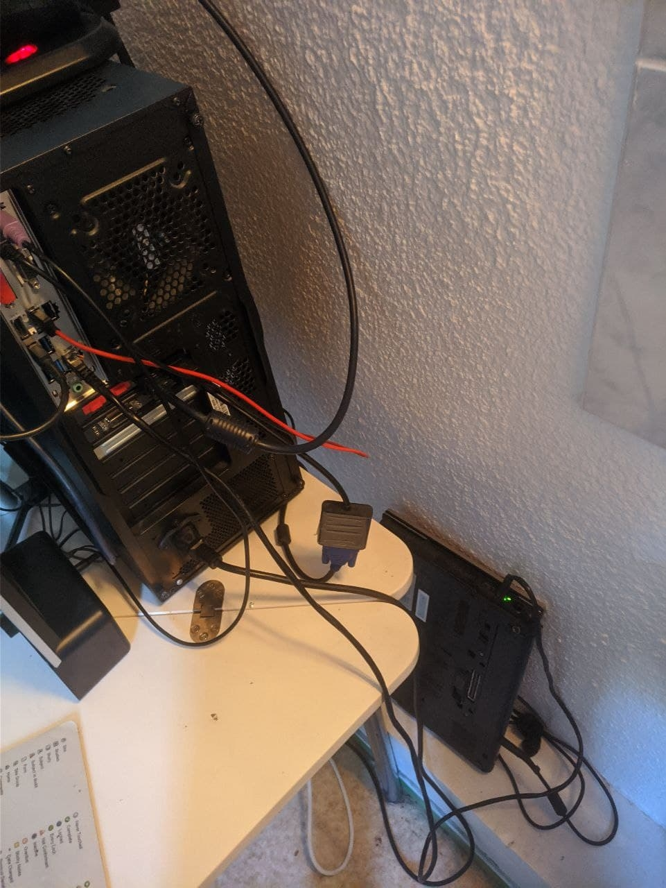

## The problem

I recently moved to a new apartment, where I don't have to pay for electricity, water or internet access. Great right ? Who likes to pay ? Anyway, of course, the "free" internet access is used by multiple tenant, so it is a wireless access point, and as it is outside the apartment, there is no way to run a good old RJ-45 cable to my desktop PC. 

Of course my desktop PC's motherboard doesn't have bundled wifi (honestly now I regret it, I should have bought a motherboard with bundled wifi). So how do I get internet access to my desktop PC ?

## Possible solutions

Of course the first and most obvious solution is to buy a **wifi card**. That would be a very good solution but of course you would have to pay for it which is not really what we want to do. While you can find theses cards for as low as 10 €, you probably have to go to 40-50 € to get a decent one.

|  | 
|:--:| 
| *A low end wifi card that you probably should not buy* |

The free solution that most people would think about first is to use a feature that's present in most modern android phone. This feature, called **USB Tethering**, allows you to use your phone as router + NAT for a computer via USB. In simple words it allows to **share the internet connection** (be it wifi or mobile data) of the phone to the computer. 

This solution is extremely easy to use and completely plug and play on Windows and on modern linux distribution like **Fedora**. You plug your phone to the computer, turn on the option on the phone, et voilà, it works.

|  | 
|:--:| 
| *USB Tethering option on Android (screenshot not from me)* |

So I was actually using this solution with one of the phone I had lying around for a while but it wasn't very satisfying in the long run. Phone are of course not meant to be used 24/7 for usb tethering, and so, in my experience it wasn't working so great for 2 reasons:

- First, since I was using an older smartphone (a very unique *Asus Zenfone 2*, that actually uses an intel x86 processor instead of a ARM as you would find in almost every smartphone) the connection was using usb 2.0. This meant that the throughput, while acceptable, is fairly limited, compared to theoretical maximum of whatever version of WiFi the access point is using. Similarly I experienced latency problems when talking to people on discord, and when playing online games such as rocket league.
- Secondly and most importantly, the connection would randomly stop working and essentially, usb tethering would stop working spontaneously.Toggling it off and back on would fix it but that's still very annoying in the middle of a discord call. The bigger problem here is that I also use my desktop PC as a **mining rig** (whit a single *MSI gtx 1060 6gb gaming X*), and I'm often away from home (or sleeping), therefore unable to manually toggle usb tethering off and back on to make it work again. This would result in downtime for my mining rig and a (admittedly small) loss of money.

Therefore I needed a better solution.

## The solution : Using a Laptop as a WiFi antenna 

Of course "WiFi antenna" is a massive misnomer here, as in fact the **Laptop** behaves much like a android phone used with usb tethering.

In my case I used a decade old HP EliteBook 8440p, but any **laptop** with **wifi** and a **RJ45** port should work. In spite of its age, this laptop actually has a very good wifi module that even supports 5GHZ WiFi. That module is not even soldered to the motherboard, and can be changed easily, as it is the case with most laptop from that era.

|  | 
|:--:| 
| *A mini pci wifi module from intel, from a amazon listing, the one in the laptop looks exactly like that* |

Now I will go over what you need to do to turn a laptop into a **RJ45 tethering device**

### Step 0 : Operating System setup

While it might be possible to do everything on windows, I used [alma Linux](https://almalinux.org/fr/), which is basically the continuation of CentOs, which was the free fork of redHat enterprise Linux, a commercial Linux distribution (I know, it's a lot more complicated than it should be).

Anyway the choice of distribution really should not matter, as long as you stick to the famous ones. You can also install a graphical environment but you won't need it so don't bother.

### First step : Connection to WiFi in command line

Under redHat based distribution all the driver for your wifi hardware should be installed by default, even if those driver are proprietary. This is one the advantage that redHat / Fedora has over debian in my opinion

Now that your wifi module is working, there is a lot of different ways to connect to wifi in command line. But in my opinion, the best and easiest way is to use network manager terminal user interface or in short `nmtui`. This is a terminal user interface based program that allows you to manage the network connection of your system (be it wired or wireless) with ease, it's part of network manager. Network manager and `nmtui` should be preinstalled on redHat based distribution, even if you did not install a graphical environment. 

However what is not preinstalled is `NetworkManager-wifi.x86_64` which is a plugin that you need in order to connect to a wifi network using `nmtui`.

You can install it with `dnf install NetworkManager-wifi.x86_64`.

Once installed just start `nmtui`, and you should be greeted with an easy to use interface where you can connect to wifi. No need for a guide on that part.

|  | 
|:--:| 
| *nmtui first screen as you start it* |

### Second step : enable the linux built in router (Aka ip forwarding)

I'm sure many people have already heard about this one: There is a *Sysfs* setting to turn your linux computer into a router. This means it's very easy and quick to do.

A single command : `sysctl -w net.ipv4.ip_forward=1`

Doing that will allow your **laptop** to act as a *router*, that means that it will forward to other host, using its routing table, packet that are not destined directly to itself (himself ? I mean the laptop).

### Third step : plug in the RJ45 on both end, configure the wired network interface

Now plug the cable on your **laptop** acting as a "Wifi antenna" on one hand and on your device where you do not have wifi (probably your desktop computer, let's now refer to it as **client**) on the other hand.

 This should work, because of auto MDI-X you don't actually need a special crossover cable, unless one of the host is extremely old (or extremely bad)

Now at this step you want to configure the network interface statically on the **laptop**, and for debugging purpose (or if you want to run static address all the time) on the **client**. 

Of course you need to make sure to setup addresses that are on the same [subnet](https://en.wikipedia.org/wiki/Subnetwork) and that they are on a [private](https://en.wikipedia.org/wiki/Private_network) subnet.

Similar to the first step you **can** , and in my opinion **should**, use `nmtui` for that configuration, since the configuration is then permanent, unlike the `ip` command.

After both host have been configured you can use the well known `ping` command to test the connection between the to two host. It should go trough, if it doesn't then there might be a problem somewhere in your configuration or your cable.

### Fourth step : enable IP masquerade (NAT)

### Fifth step (optional): Install a DHCP server and configure it

## Conclusion 

|  | 
|:--:| 
| *A picture of the setup in production* |

